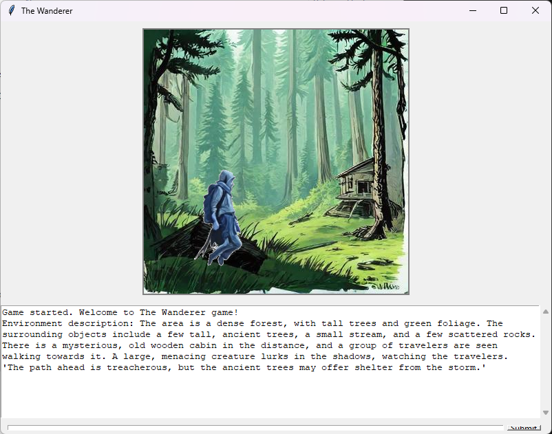
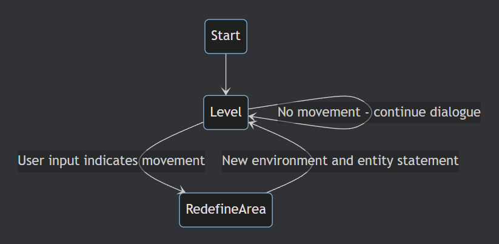

# The Wanderer Game
The Wanderer is a single-player adventure game where players explore foreign lands, overcoming challenges, engaging in dynamic dialogues, and making strategic movement decisions that shape the story and environment.

**The game leverages DeepSeek's Janus-Pro 7B LLM for generating dynamic narratives and interactions.**



## To Run
> Tested with Python 3.10.16

```bash
pip install -r requirements.txt
python python -m src.frontend
```

### **Instructions for Model Setup**  
#### **Option 1: Manually Copy Model Files**  
You can manually copy the model files for **`deepseek-ai/Janus-Pro-7B`** into the following directory:  
.\the-wanderer\models\janus\Janus-Pro-7B
#### **Option 2: Automatic Download**  
If the model files are not found, they will be automatically downloaded when running the program.  

### **Description of Game Progression**  


A level consists of a specific environment (area) description and its corresponding image.  
During the game, a **helpful entity** speaks to the **wanderer**, providing information that may reveal opportunities and threats. The user replies to this entity.

The user's input may:
1. **Continue the dialogue**, prompting further responses from the helpful entity within the same level (staying in the same area).
2. **Indicate movement**, triggering the generation of a new level with a new environment (description and image) and a new statement from the helpful entity.

Each new level logically follows from the previous one, adapting to the user's input.



[//]: # (```mermaid)

[//]: # (stateDiagram)

[//]: # (    Start --> Level)

[//]: # (    Level --> Level: No movement - continue dialogue)

[//]: # (    Level --> RedefineArea: User input indicates movement)

[//]: # (    RedefineArea --> Level: New environment and entity statement)

[//]: # (```)
 
## Further Steps  
1. Containerize the backend and expose it as an API.  
2. Expand the game logic by adding more states.  
3. Increase image resolution and embed the wanderer into the environment using Stable Diffusion (e.g., IP-Adapter).  
4. Implement additional talking entities (partially coded).  
5. GUI improvement


---

### Poetry: The Wanderer’s Path

Alone he walks, a fleeting shade,
Through lands unknown, through light and fade.
No hearth to warm, no friend to call,
A ghost among the great and small.

He keeps his step so soft, so low,
A whisper where the wild winds blow.
Eyes sharp, yet never seen,
A stranger lost in worlds between.

No place to rest, no roots to grow,
The road is all he’ll ever know.
Mingling close, yet far away,
A name unspoken, gone by day.

From distant center, drawn yet free,
A shadow drifting endlessly.
He bends, he shifts, he learns the game,
But never leaves a trace of name.

And soon he fades, as all must do,
Like mist dissolving in the blue.
No past, no future, just the night—
The wanderer lost in fading light.
